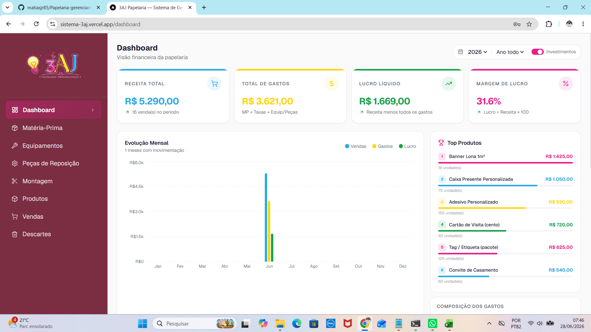
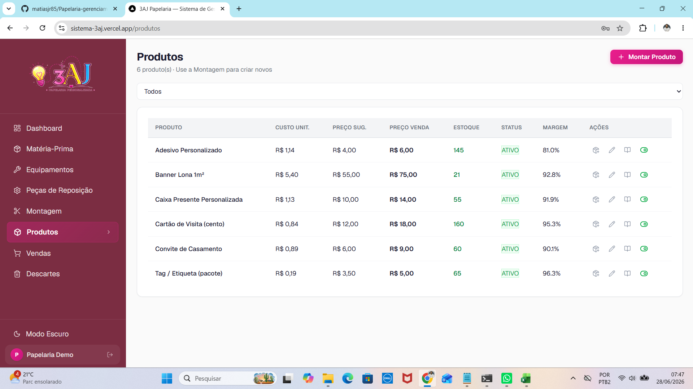
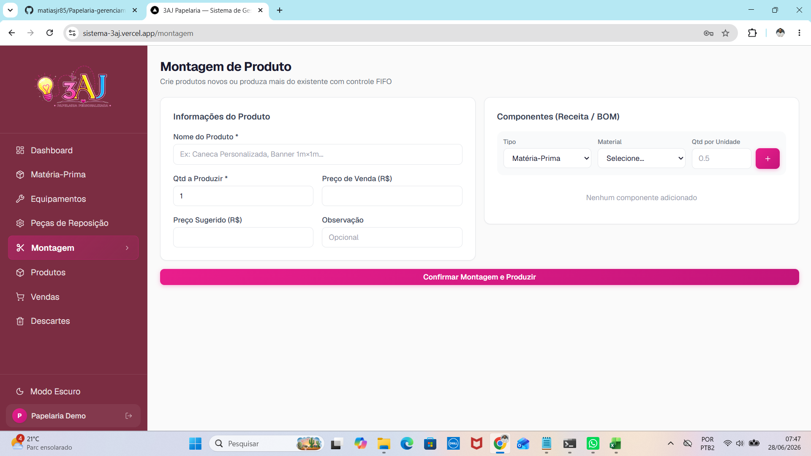
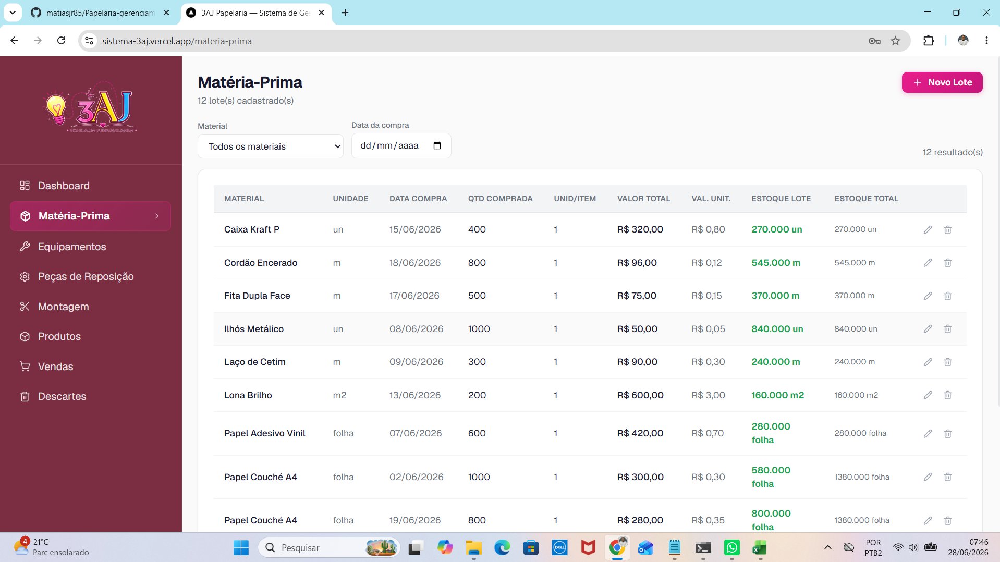
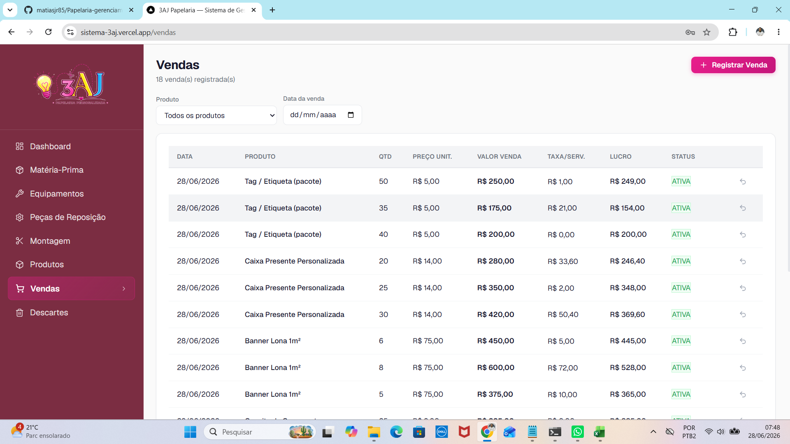
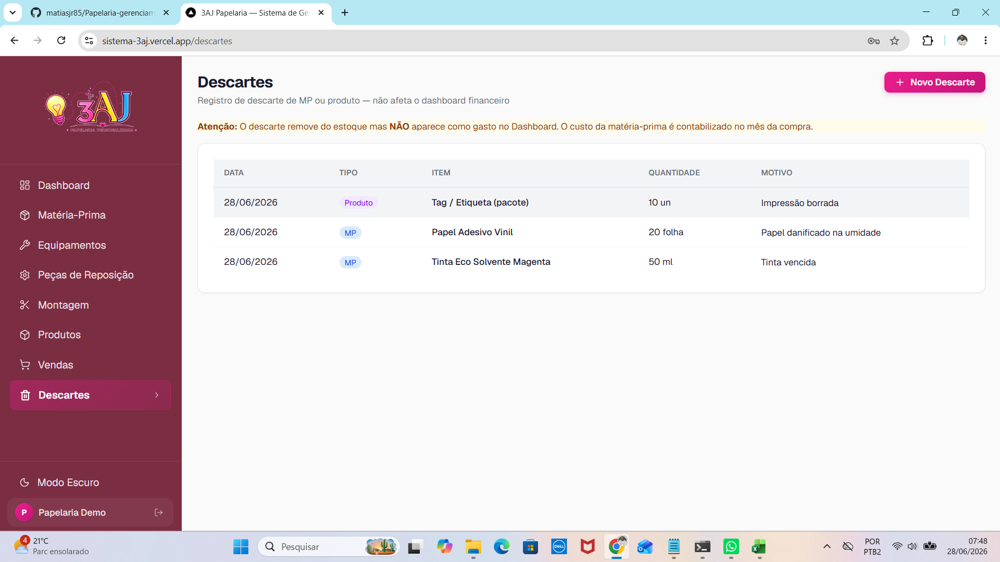
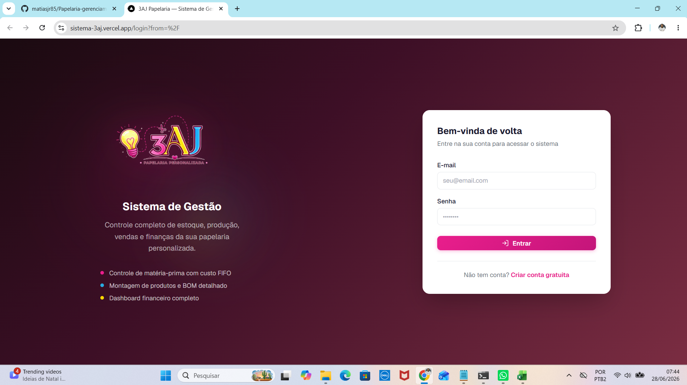

# 3AJ Papelaria — Sistema de Gestão

Aplicação web **multi-tenant** para gestão completa de uma papelaria personalizada: do controle de **matéria-prima** (com custo **FIFO**), passando pela **produção** de produtos via receita (BOM), até **vendas**, **devoluções** e um **dashboard financeiro** com lucro real.

🔗 **Aplicação no ar:** https://sistema-3aj.vercel.app · **Conta demo:** `demo@3aj.com` / `demo2026`

> Cada usuário enxerga **somente os próprios dados** (isolamento multi-tenant em todas as queries).

---

## 📸 Capturas de tela

### Dashboard financeiro
Receita, gastos, **lucro real** (receita − custo FIFO), margem, evolução mensal, top produtos e composição de gastos.



### Produtos & Montagem
Produtos com receita (BOM), custo, preço, estoque e margem · Montagem com consumo FIFO de matéria-prima.

| Produtos | Montagem (FIFO) |
|---|---|
|  |  |

### Matéria-Prima, Vendas e Descartes

| Matéria-Prima (com filtros) | Vendas |
|---|---|
|  |  |

| Descartes | Login |
|---|---|
|  |  |

---

## ✨ Funcionalidades

- **Matéria-Prima (lotes)** — cadastro com cálculo automático de valor unitário; novos lotes do mesmo material em datas/preços diferentes; **filtros** por material e data.
- **Equipamentos & Peças** — controle de investimentos.
- **Montagem / Produção (FIFO)** — produz produtos consumindo MP do **lote mais antigo primeiro**; custo unitário calculado automaticamente; detecção de produto novo × "produzir mais".
- **Produtos (BOM)** — bill of materials, custo, preço, estoque, status (ativo/arquivado), edição de receita e **"produzir mais"** direto da tela com pré-visualização do custo.
- **Vendas** — pré-visualização ao vivo do lucro, registro com **snapshot congelado** (preço/custo/lucro), **trava anti-duplo-clique** (idempotência) e **filtros** por produto e data.
- **Devoluções** — restauram estoque e preservam o histórico (soft delete).
- **Descartes** — histórico de perdas sem impacto no dashboard.
- **Dashboard** — KPIs, evolução mensal, top produtos, composição de gastos e toggle de investimentos; sempre atualizado com **lucro real** (receita − custo FIFO).
- **UX premium** — dark mode, skeleton loaders, empty/error states, toasts e diálogos de confirmação; responsivo (sidebar vira drawer no mobile).

---

## 🧱 Stack

| Camada | Tecnologia |
|---|---|
| Framework | Next.js 16 (App Router) + React 19 |
| Linguagem | TypeScript 5 |
| Estilização | Tailwind CSS v4 + CSS Variables |
| Auth | JWT customizado (`jose`) + `bcryptjs` |
| ORM / Banco | Prisma · SQLite (dev) → PostgreSQL/Neon (prod) |
| Validação | Zod (frontend + backend) |
| Gráficos | Recharts · **Dark mode** com next-themes |
| Testes | Playwright (E2E) + suíte de integração de API |
| Deploy | Vercel (funções em São Paulo / `gru1`) + Neon Postgres |

---

## 🔒 Segurança

- `NEXTAUTH_SECRET` obrigatório em produção (**fail-fast** se ausente) — nenhuma chave hardcoded.
- **Security headers** (HSTS, X-Frame-Options, X-Content-Type-Options, Referrer-Policy, Permissions-Policy); `X-Powered-By` removido.
- **Rate limiting** anti brute-force nas rotas de autenticação.
- Cookies `httpOnly` + `secure` (produção) + `sameSite`.
- Multi-tenant: toda query filtra por `userId`.
- Segredos só em variáveis de ambiente — `.env` e bancos locais fora do versionamento.

---

## 🚀 Rodar Localmente

```bash
npm install
cp .env.example .env          # configure DATABASE_URL e NEXTAUTH_SECRET
npx prisma migrate dev --name init
npm run db:seed               # opcional: usuário demo
npm run dev                   # → http://localhost:3000
```

> Dev usa SQLite por padrão; produção usa PostgreSQL (ver `docs/deploy-vercel.md`).

### Variáveis de ambiente

```env
DATABASE_URL="file:./dev.db"          # dev (SQLite) | prod: postgresql://...
NEXTAUTH_SECRET="gerar-com-openssl-rand-base64-32"
NEXTAUTH_URL="http://localhost:3000"
```

---

## 🧪 Testes

```bash
npm run test:e2e                    # Playwright (login, navegação, fluxos)
node tests/api-integration.mjs      # integração: todos os endpoints e regras de negócio
```

Cobertura: autenticação, CRUDs, produção FIFO, idempotência de venda, devolução, descarte, **isolamento multi-tenant**, validações e métodos HTTP.

---

## 📜 Comandos

```bash
npm run dev          # desenvolvimento
npm run build        # build de produção
npm run start        # servidor de produção
npm run lint         # ESLint
npm run db:seed      # popular banco
npx prisma studio    # GUI do banco
```

---

## 🗂️ Arquitetura

```
src/
├── app/
│   ├── (auth)/          # login, cadastro
│   ├── (dashboard)/     # área autenticada (8 telas)
│   └── api/             # Route Handlers (REST)
├── components/
│   ├── layout/          # Sidebar, Header
│   ├── feedback/        # EmptyState, ErrorState, Skeleton
│   └── ui/              # KpiCard, ThemeToggle, UiProvider (Toast + Confirm)
├── lib/
│   ├── auth.ts          # JWT + sessão
│   ├── fifo.ts          # algoritmo FIFO
│   ├── rate-limit.ts    # rate limiter
│   ├── api-error.ts     # tratamento de erro centralizado
│   └── validations.ts   # schemas Zod
└── proxy.ts             # gate de autenticação (Next.js 16)
```

---

## 📚 Documentação

| Arquivo | Conteúdo |
|---|---|
| `docs/deploy-vercel.md` | Guia de deploy (Vercel + PostgreSQL) |
| `docs/design-system.md` | Tokens, componentes, dark mode |
| `docs/01-auditoria-fase1.md` | Auditoria técnica |
| `docs/decisoes-tecnicas.md` | Decisões e trade-offs |

---

> Projeto desenvolvido a partir da lógica de negócio de uma planilha de gestão, replicada fielmente em sistema web multi-usuário.
